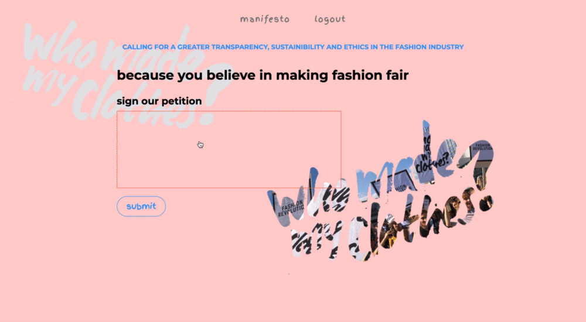

# Petition

This site is made almost in a week during my training at SPICED Academy Berlin.
It's an online petition that can be signed in real on Heroku here https://fashionrevolution.herokuapp.com/

As a volunteer of the Fashion Revolution in Berlin, this site is an example of how to reach out to everybody that loves fashion but is frustrated about how the fashion industry has evolved.

# Tech Stack

* HTML, CSS, Javascript, Node.js, Express, Hanldebars, PostgreSQL

       Including a database with three tables:
              - Users with firstname, lastname, email, password
              - Users_profiles with age, city, homepage
              - Signatures with signature, user_id

## Demo petition

### Sign online petition

After registering you can add more information about yourself and sign the online petition.

### See all signers

See all signers or have a look at them divided by cities.

### Edit profile or delete signature

Additionaly you can edit your profile information, delete your signature which makes you unsign the petition or simply logout and login again.

### Fashion Revolution Manifesto

*Who made my clothes?* asks about where our clothes are produced and especially from whom their made. This site takes reference to the Fashion Revolution.
